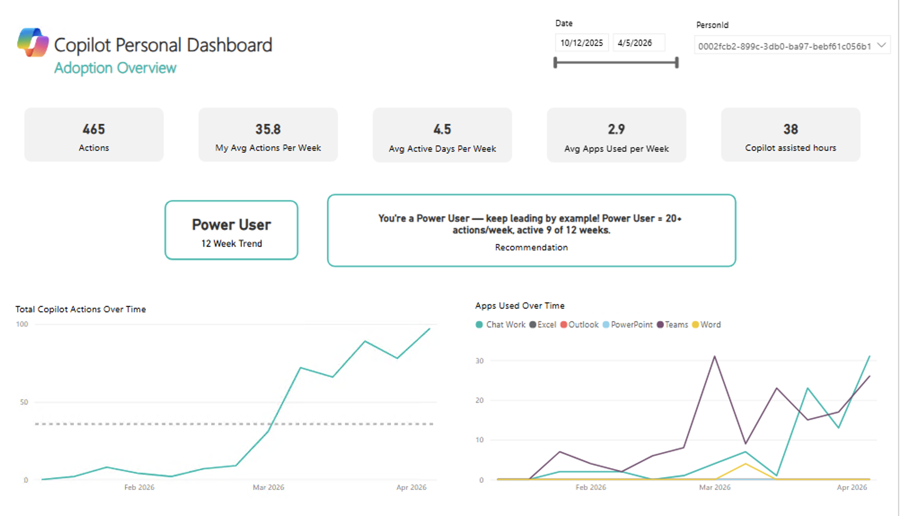
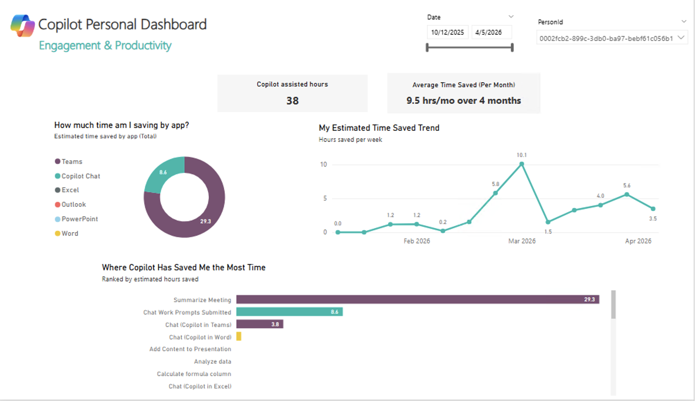

# copilot-personal-dashboard
 ---                                                                                                         
                  
  ## What's in This Report

  ### Tab 1 – Adoption Overview                                                                               
  Track your Copilot usage over time and across apps. See your total
  actions, weekly average, active days, apps used per week, and estimated                                     
  time saved. Your User Category and a personalized recommendation display                                    
  based on your recent habits. Use the date slider to zoom in on any time                                     
  period.                                                                                                     
                                                                                                              
  ### Tab 2 – Engagement & Productivity                                                                       
  See how much time Copilot is saving you, broken down by app and by week.
  View which specific Copilot features are saving you the most hours,                                         
  ranked by estimated time saved, and track how your savings trend has                                        
  changed month over month.                                                                                   
                                                                                                              
  ### Tab 3 – Usage Comparison                                                                                
  Compare your Copilot usage against your organization. See how your weekly
  app actions stack up against the org average, where you rank across apps                                    
  (Outstanding Performance, Strong Performance, or Growth Area), and how                                      
  your organization is distributed across user categories.                                                    
                                                                                                              
  ---                                                                                                         
                  
  ## Screenshots

  | Adoption Overview | Engagement & Productivity | Usage Comparison |                                        
  |---|---|---|
  |  |  |                             
   |

  ---

  ## Prerequisites                                                                                            
   
  - Microsoft 365 Copilot license                                                                             
  - Access to Viva Insights or a CopilotMetrics data export
  - Power BI Desktop (free download from Microsoft)                                                           
                                                                                                              
  ---                                                                                                         
                                                                                                              
  ## How to Set It Up

  1. Download `CopilotPersonalDashboard.pbit`                                                                 
  2. Open it in Power BI Desktop
  3. When prompted, connect to your `CopilotMetrics` data source                                              
  4. Use the **PersonId** slicer to filter to your own ID                                                     
  5. Publish to Power BI Service to access it from your browser                                               
                                                                                                              
  ---                                                                                                         
                                                                                                              
  ## Tips         

  - Use the **date slider** (top of each tab) to filter by the last                                           
    4 weeks, last quarter, or any custom range.
  - Hover over the **ⓘ info buttons** next to charts for detail on                                            
    how each metric is calculated.                                                                            
  - This report refreshes weekly — timing may vary by your                                                    
    organizational configuration.                                                                             
                                                                                                              
  ---                                                                                                         
                  
  ## Glossary

  | Term | Definition |
  |---|---|
  | **Org Average** | The average usage across all employees in your organization with a Copilot license. |
  | **Peer Rank / Percentile** | Where you fall compared to peers. "Top 20%" means you use Copilot more than  
  80% of colleagues. Lower number = higher rank. |                                                            
  | **User Category** | Your usage tier — Power User, Habitual User, Novice User, Low User, or Non-User —     
  based on your consistency and volume over the last 12 weeks. |                                              
  | **Outstanding / Strong / Growth Area** | How your usage ranks per app within your org. Outstanding = Top
  10%, Strong = Top 25%, Growth Area = Bottom 50%. |                                                          
  | **Consistency** | How many weeks you used Copilot out of the weeks in your selected date range. |
  | **Actions** | Each time you use a Copilot feature (e.g., drafting an email, summarizing a meeting) counts 
  as one action. |                                                                                            
  | **Time Saved** | An estimate based on Microsoft's research — each Copilot action saves ~6 minutes. Meeting
   summaries count the actual meeting length, and Intelligent Recap saves ~30 minutes. |                      
  | **Peak Week** | The single week where you used Copilot the most. |
