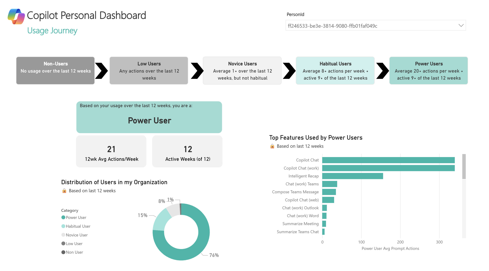
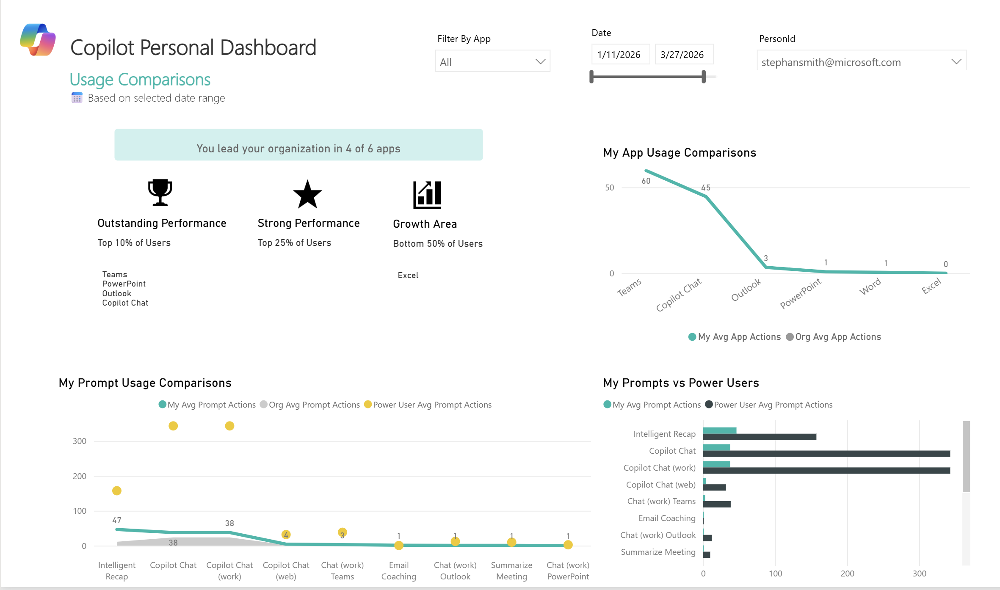

# copilot-personal-dashboard
 ---                                                                                                         
                  
  ## What's in This Report

  ### Tab 1 – Adoption Overview                                                                               
  Track your Copilot usage over time and across apps. See your total
  actions, weekly average, active days, apps used per week, and estimated time saved. Your User Category and a personalized        
  recommendation display based on your recent habits. Use the date slider to zoom in on any time                              
  period.                                                                                                     
                                                                                                              
  ### Tab 2 – Engagement & Productivity                                                                       
  See how much time Copilot is saving you, broken down by app and by week. View which specific Copilot features are saving you the 
  most hours, ranked by estimated time saved, and track how your savings trend has changed month over month.                                                                                   
                                                                                                              
  ### Tab 3 – Usage Journey
  See your Copilot adoption journey over the last 12 weeks. Track how you progressed through user categories (Non-User → Low User → Novice → Habitual → Power User), view the distribution of users in your organization, and discover the top features used by power users. Includes a prompt-level comparison of your usage vs. power users.

  ### Tab 4 – Usage Comparisons
  Compare your Copilot usage against your organization. See how your weekly app actions stack up against the org average, where you rank across apps (Outstanding Performance, Strong Performance, or Growth Area), and how your organization is distributed across user categories.

  ---

  ## Screenshots

  | Adoption Overview | Engagement & Productivity |
  |---|---|
  |  |  |

  | Usage Journey | Usage Comparisons |
  |---|---|
  |  |  |

  ---

  ## Prerequisites

  - Microsoft 365 Copilot license — required to generate usage data
  - Viva Insights access — Analyst Workbench for person queries
  - Power BI Desktop — [free download from Microsoft](https://powerbi.microsoft.com/desktop/)
  - **Identifiable user attribute (PersonId)** — upload a custom attribute (recommended: work email) so each user's data maps correctly

  ---

  ## How to Set It Up

  ### Step 1 — Build the Person Query in Viva Insights

  1. Go to [analysis.insights.cloud.microsoft](https://analysis.insights.cloud.microsoft) and click **Analysis results**
  2. Click **Create analysis** → **Person query** → **Set up analysis**
  3. Configure the query:
     - **Time period:** Last 6 months (rolling)
     - **Group by:** Week
     - **Filter:** Is Active = True
     - **Attributes:** Organization, FunctionType, TimeZone (minimum required)
  4. Under the **Microsoft 365 Copilot** category, select **All metrics**
     > ⚠️ Missing even one metric will cause blank visuals in Power BI
  5. Click **Save & Run** and wait until **Status = Completed**
  6. Once complete, copy your **Partition ID** and **Query ID** for use in Power BI

  Key metrics that power this dashboard:

  | Metric | Used For |
  |---|---|
  | Copilot assisted hours | Total time saved KPI |
  | Total Copilot actions taken | Adoption overview & trends |
  | Copilot actions taken in [App] | Per-app breakdown |
  | Total Meeting hours summarized or recapped | Teams time saved calculation |
  | Intelligent recap actions taken | Meeting recap tracking |
  | Days of active Copilot usage in [App] | Consistency & active days |

  ### Step 2 — Connect to Power BI

  1. Download your preferred template:
     - **CSV Import:** `Viva Insights Personal Dashboard V8 (CSV pbit).pbit`
     - **Direct Query:** `Viva Insights Personal Dashboard V8 (Direct Link).pbit`
  2. Open it in Power BI Desktop
  3. When prompted, connect to your data source:
     - **CSV Import:** enter the file path to your exported CSV
     - **Direct Query:** enter your **Partition ID** and **Query ID** from Viva Insights
  4. Use the **PersonId** slicer to filter the report to your own data
  5. Publish to Power BI Service via **File → Publish** to access from your browser

  ### Optional — Configure Row-Level Security (RLS)

  To restrict users to only their own data when the report is published:

  1. In Power BI Desktop, go to **Modeling → Manage roles** and create a role (e.g. `ViewOwnData`)
  2. Select the table containing `PersonId` and add the DAX filter:
     ```
     [PersonId] = USERPRINCIPALNAME()
     ```
  3. Test via **Modeling → View as Roles**, then publish to Power BI Service
  4. In the service, go to the dataset → **Security** and assign users or an Azure AD group to the role

  > Note: `USERPRINCIPALNAME()` resolves to the user's email — ensure `PersonId` values match that format.                                               
                                                                                                              
  ---                                                                                                         
                                                                                                              
  ## Tips         

  - Use the **date slider** (top of each tab) to filter by the last                                           
    4 weeks, last quarter, or any custom range.                                                                           
  - This report refreshes weekly — timing may vary by your                                                    
    organizational configuration.                                                                             
                                                                                                              
  ---                                                                                                         
                  
  ## Glossary

  | Term | Definition |
  |---|---|
  | **Org Average** | The average usage across all employees in your organization with a Copilot license. |
  | **Peer Rank / Percentile** | Where you fall compared to peers. "Top 20%" means you use Copilot more than 80% of colleagues. Lower number = higher rank. |                                                            
  | **User Category** | Your usage tier — Power User, Habitual User, Novice User, Low User, or Non-User - based on your consistency   and volume over the last 12 weeks. |                                              
  | **Outstanding / Strong / Growth Area** | How your usage ranks per app within your org. Outstanding = Top 10%, Strong = Top 25%, Growth Area = Bottom 50%. |                                                          
  | **Consistency** | How many weeks you used Copilot out of the weeks in your selected date range. |
  | **Actions** | Each time you use a Copilot feature (e.g., drafting an email, summarizing a meeting) counts as one action. |                                                                                            
  | **Time Saved** | An estimate based on Microsoft's research — each Copilot action saves ~6 minutes. Meeting summaries count the actual meeting length, and Intelligent Recap saves ~30 minutes. |                      

